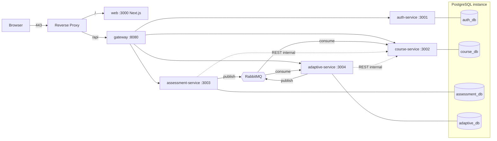

# Container Architecture

**Tujuan:** container runtime dan jalur komunikasinya. **Status:** DRAFT. Penjelasan: [03](../03-system-architecture.md).

```mermaid
flowchart LR
    B[Browser] -->|443| RP[Reverse Proxy]
    RP -->|/| WEB[web :3000 Next.js]
    RP -->|/api| GW[gateway :8080]
    GW --> AUTH[auth-service :3001]
    GW --> CRS[course-service :3002]
    GW --> ASM[assessment-service :3003]
    GW --> ADP[adaptive-service :3004]
    subgraph PG[PostgreSQL instance]
      D1[(auth_db)]
      D2[(course_db)]
      D3[(assessment_db)]
      D4[(adaptive_db)]
    end
    AUTH --- D1
    CRS --- D2
    ASM --- D3
    ADP --- D4
    ASM -->|publish| MQ{{RabbitMQ}}
    MQ -->|consume| ADP
    ADP -->|publish| MQ
    MQ -->|consume| CRS
    ASM -.->|REST internal| CRS
    ADP -.->|REST internal| CRS
```

Port internal bersifat usulan.
