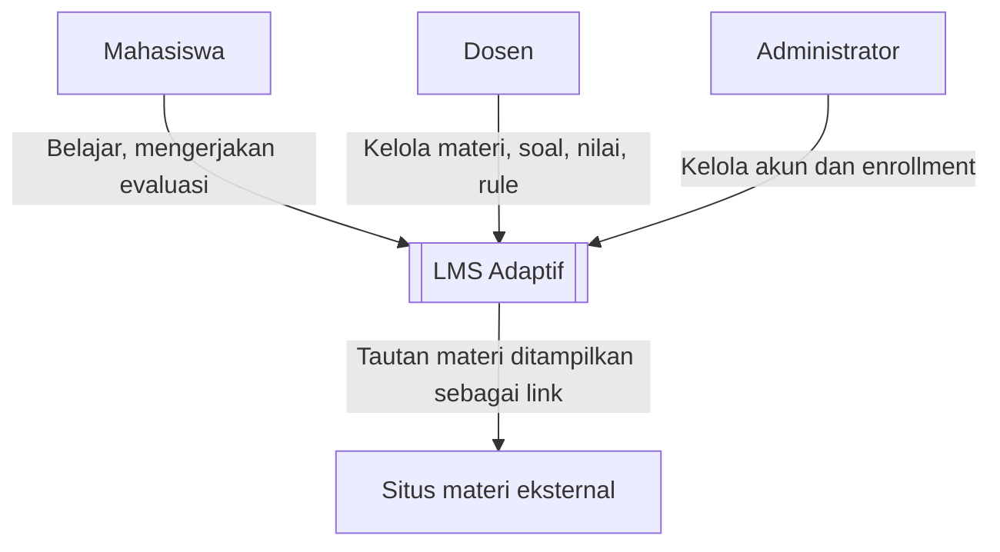

# System Context

**Tujuan:** menunjukkan siapa berinteraksi dengan sistem. **Status:** DRAFT.

```mermaid
flowchart TB
    M[Mahasiswa] -->|Belajar, mengerjakan evaluasi| LMS
    D[Dosen] -->|Kelola materi, soal, nilai, rule| LMS
    A[Administrator] -->|Kelola akun dan enrollment| LMS
    LMS[[LMS Adaptif]]
    LMS -->|Tautan materi ditampilkan sebagai link| EXT[Situs materi eksternal]
```

Tidak ada integrasi API pihak ketiga. Situs eksternal hanya tujuan tautan yang dibuka pengguna.
