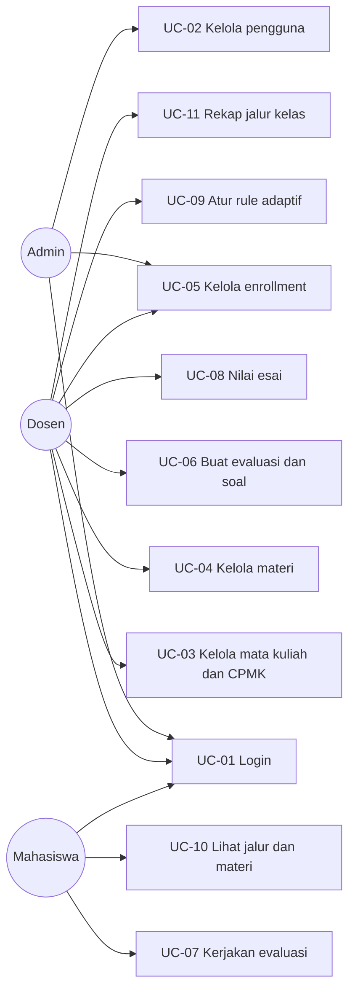

# Use Case Diagram

**Tujuan:** interaksi aktor dan sistem. **Status:** DRAFT. Rincian: [02 §5](../02-requirements.md).

```mermaid
flowchart LR
    ADM((Admin)) --> UC01[UC-01 Login]
    LEC((Dosen)) --> UC01
    STU((Mahasiswa)) --> UC01
    ADM --> UC02[UC-02 Kelola pengguna]
    ADM --> UC05[UC-05 Kelola enrollment]
    LEC --> UC05
    LEC --> UC03[UC-03 Kelola mata kuliah dan CPMK]
    LEC --> UC04[UC-04 Kelola materi]
    LEC --> UC06[UC-06 Buat evaluasi dan soal]
    LEC --> UC08[UC-08 Nilai esai]
    LEC --> UC09[UC-09 Atur rule adaptif]
    LEC --> UC11[UC-11 Rekap jalur kelas]
    STU --> UC07[UC-07 Kerjakan evaluasi]
    STU --> UC10[UC-10 Lihat jalur dan materi]
```
